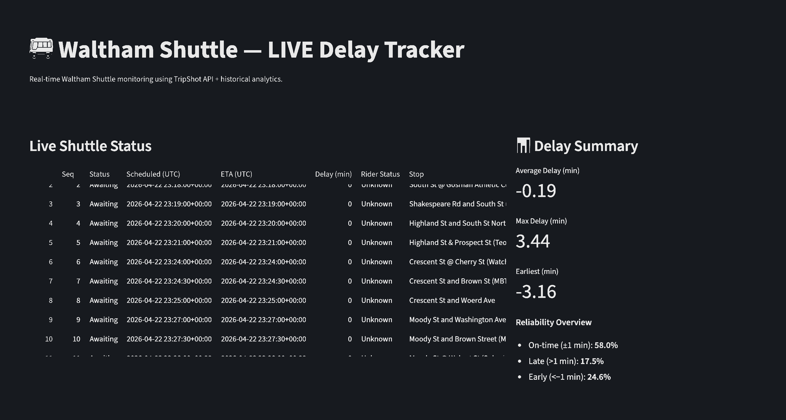
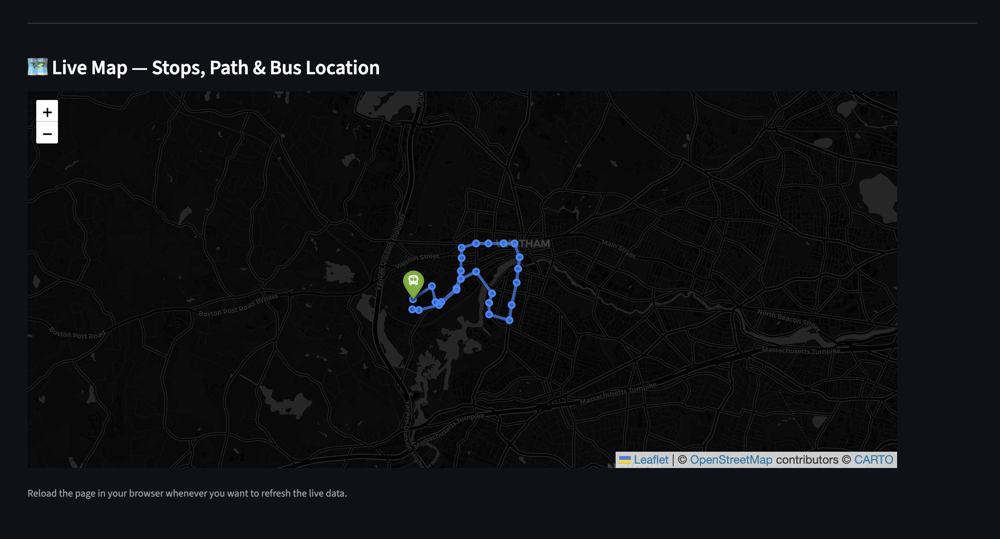

# shuttle-delay-prediction-dashboard

# Real-Time Brandeis Shuttle Tracking and Delay Prediction Dashboard

## Overview

This project focuses on building a real-time shuttle tracking system for the Brandeis/Waltham shuttle network using live Tripshot data. The goal was to make shuttle movement and delays easier to understand for students through a simple and intuitive interface.

## Problem

Students often face uncertainty regarding shuttle arrival times due to inconsistent tracking information and lack of clear delay visibility. Existing systems do not provide an intuitive or reliable view of real-time shuttle status.

## Approach

* Integrated live data from Tripshot API endpoints
* Mapped stop IDs to human-readable stop names
* Handled route variations (weekday vs weekend/holiday routes)
* Designed logic to estimate delays based on shuttle movement patterns
* Built a dashboard concept to display real-time shuttle status

## Tools Used

* Python
* Streamlit
* API Integration
* Data Cleaning and Transformation

## Key Insights

* Route inconsistencies (especially weekends/holidays) significantly affect tracking reliability
* Missing or inconsistent API fields require fallback logic for stable tracking
* Mapping stop IDs to names is critical for usability

## Future Improvements

* Improve delay prediction using historical data
* Add route-specific filtering
* Deploy as a live web application

## Outcome

Developed a practical solution to improve campus commuting visibility by making shuttle tracking more accessible and user-friendly.
